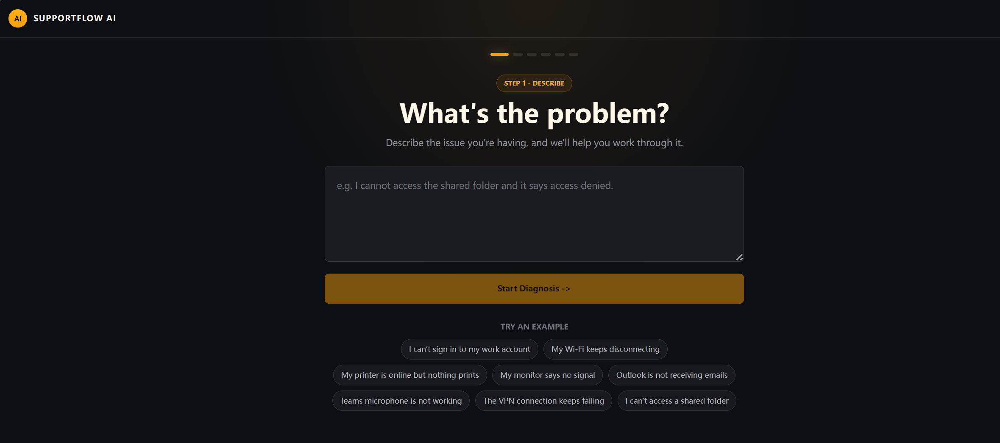
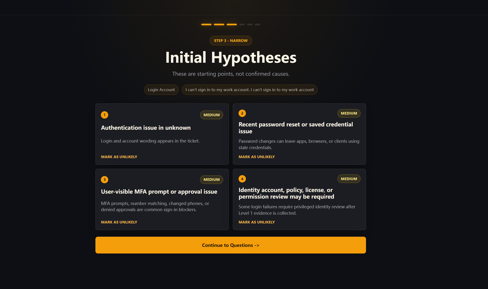
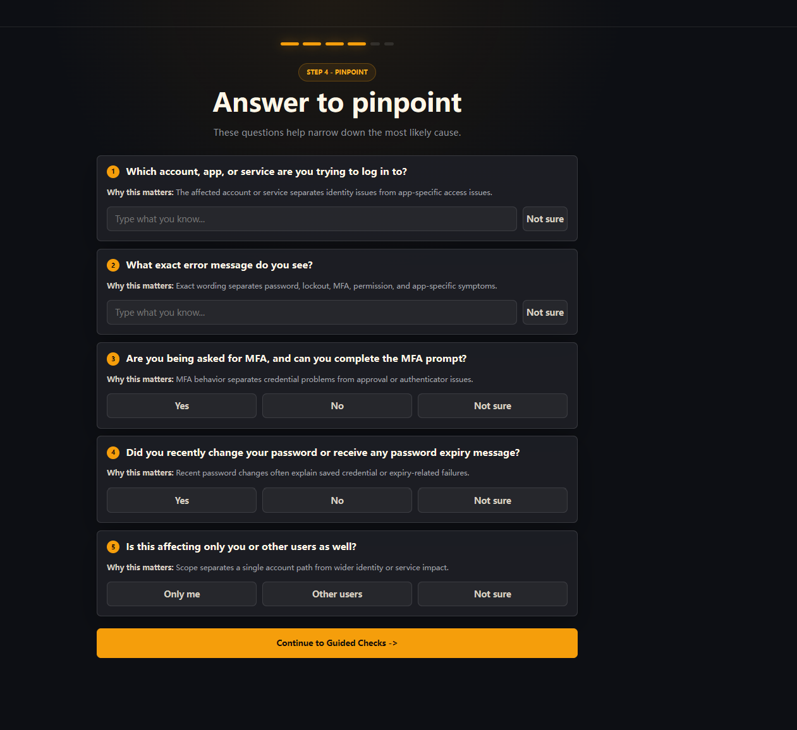
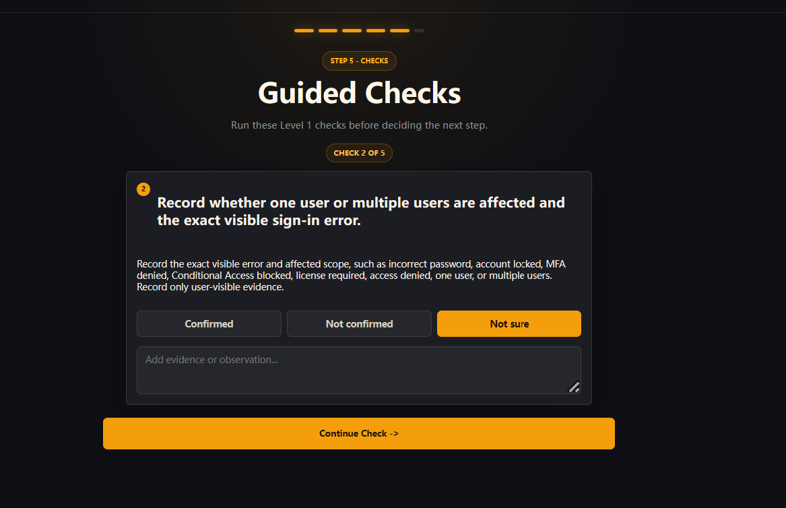
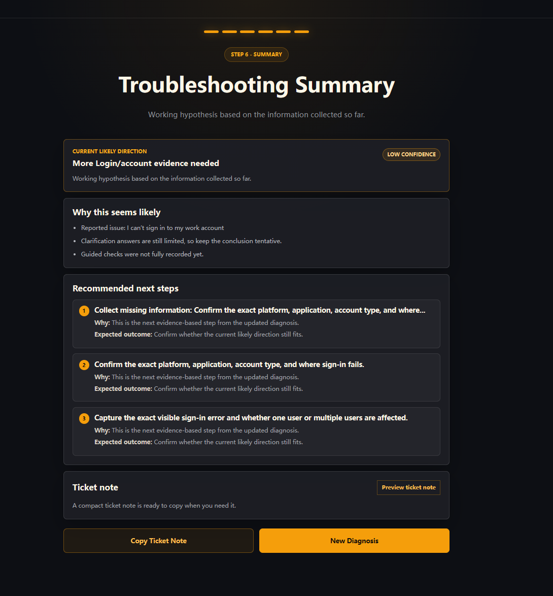

# SupportFlow AI

A web-based AI-assisted IT support intake and triage prototype that turns unclear IT issues into structured support tickets, missing information prompts, guided Level 1 checks, and copyable support notes.

## Overview

SupportFlow AI explores how an IT service desk can turn a loosely described problem into a more consistent intake and triage workflow. A user or support agent describes an issue in natural language, and the application organizes the report into a category, semantic signals, follow-up questions, bounded checks, and reusable ticket notes.

The project assists support intake; it does not replace an IT professional, inspect real systems, or confirm a root cause.

## Problem Statement

IT tickets often begin with incomplete reports such as “email is broken” or “the printer does not work.” Support staff must identify the affected service, action, failure mode, scope, timing, and business impact before useful troubleshooting can begin. SupportFlow AI demonstrates a structured, safety-conscious way to collect that context and guide initial Level 1 investigation.

## Key Features

- Natural-language issue intake
- IT category classification
- Missing-information detection and targeted clarification questions
- Semantic signal extraction for application/service, action, and failure mode
- Safe deterministic fallback behavior when an LLM is unavailable or returns invalid output
- Guided Level 1 checks selected from controlled playbooks
- Structured, copyable ticket-note generation
- Safety guardrails that reject unsupported admin, log, system-state, and root-cause claims
- Automated backend tests for schemas, routes, providers, question selection, and evidence-aware diagnosis

## Tech Stack

- **Frontend:** React 19, TypeScript, Vite
- **Backend:** Python, FastAPI, Pydantic
- **AI integration:** OpenAI-compatible chat-completions endpoint through a provider abstraction
- **Testing:** pytest and FastAPI TestClient
- **Package tooling:** pnpm (npm can also run the frontend scripts)

## Architecture

```text
React + TypeScript frontend
        |
        | JSON over /api
        v
FastAPI routes and Pydantic schemas
        |
        v
AIProvider interface
  |-- StructuredLLMAnalyzeProvider
  |     |-- validates structured output and safety rules
  |     `-- falls back when configuration or output is unsafe
  `-- MockAIProvider (deterministic fallback)
        |
        v
Playbooks, semantic-signal question selection,
guided checks, and ticket-note generation
```

See [Architecture](docs/architecture.md) for more detail.

## How It Works

1. Enter a title, issue description, impact, urgency, and any known device or service details.
2. The backend classifies the issue, extracts useful signals, and identifies missing context.
3. The interface presents focused clarification questions and controlled Level 1 checks.
4. Recorded results update the working diagnosis without claiming a confirmed root cause.
5. The app generates structured notes that can be copied into a support ticket.
6. If LLM configuration is absent or its output fails validation, the deterministic provider keeps the workflow available with more limited interpretation.

## Setup Instructions

### Prerequisites

- Python 3.12 or newer
- Node.js 20 or newer
- pnpm, or npm as an alternative

### Backend

```powershell
cd backend
python -m venv .venv
.\.venv\Scripts\Activate.ps1
python -m pip install -r requirements.txt
```

Copy the example environment file and replace placeholders only in your local `.env` or shell environment:

```powershell
Copy-Item ..\.env.example ..\.env
```

Supported environment variables:

| Variable | Purpose |
| --- | --- |
| `AI_PROVIDER` | Set to `structured_llm` to enable LLM-assisted analysis; otherwise the fallback provider is used. |
| `OPENAI_API_KEY` | API credential supported by the structured provider. Use this or `LLM_API_KEY`. |
| `LLM_API_KEY` | Alternative API credential variable. Use this or `OPENAI_API_KEY`. |
| `LLM_MODEL` | Model identifier for the configured provider. |
| `LLM_BASE_URL` | Optional OpenAI-compatible chat-completions URL. |

Example values are placeholders only:

```dotenv
AI_PROVIDER=structured_llm
OPENAI_API_KEY=your_api_key_here
LLM_MODEL=your_model_here
# LLM_BASE_URL=https://api.example.com/v1/chat/completions
```

If no LLM key is configured, the app uses safe deterministic fallback behavior.

### Frontend

```powershell
cd frontend
pnpm install
```

With npm, use `npm install` instead.

## Running the App

Start the backend from `backend`:

```powershell
python -m uvicorn app.main:app --reload --host 127.0.0.1 --port 8000
```

In a second terminal, start the frontend from `frontend`:

```powershell
pnpm dev
```

With npm, use `npm run dev`.

- Frontend: [http://127.0.0.1:5173](http://127.0.0.1:5173/)
- Backend API docs: [http://127.0.0.1:8000/docs](http://127.0.0.1:8000/docs)

Vite proxies `/api` requests to the backend during local development.

## Running Tests

From `backend`:

```powershell
python -m pytest -q
```

Build the frontend from `frontend`:

```powershell
pnpm build
```

The project currently has no frontend lint script. See the final verification report or run the commands locally for current results.

## Example Scenarios

- A document was sent to an office printer, but nothing printed.
- VPN authentication fails after a remote user enters their password.
- Outlook is not receiving new messages, and webmail status is unknown.
- A user receives “Access Denied” on a shared folder that teammates can open.
- Other meeting participants cannot hear a user in Teams, although the headset works elsewhere.

Additional coverage ideas are listed in [Test Scenarios](docs/test-scenarios.md).

## Current Limitations

- This is a portfolio prototype, not a production-ready service desk platform.
- It is not connected to Jira or ServiceNow.
- It is not connected to Microsoft 365, Intune, Active Directory, logs, admin portals, or endpoint-management systems.
- It does not inspect real system state or confirm a root cause.
- LLM-based semantic understanding requires API-key and model configuration.
- The deterministic fallback is intentionally limited compared with a configured LLM.
- Evidence-aware diagnosis remains an experimental foundation and requires further development before real operational use.

See [Limitations](docs/limitations.md) for the project boundaries and safety assumptions.

## Future Improvements

- Add evidence-source integrations with explicit permissions and auditability.
- Improve evidence-aware ranking while preserving uncertainty and traceability.
- Add optional ticket-system export after human review.
- Add frontend component and end-to-end tests.
- Expand accessible interaction states and responsive-layout coverage.
- Add observability and privacy controls suitable for a production design.

## Screenshots

### Issue intake

Describe an IT issue in plain language or start from a representative example.



### Initial hypotheses

Review possible support directions presented explicitly as starting points rather than confirmed causes.



### Clarification questions

Collect the missing details that help narrow the issue safely.



### Guided Level 1 checks

Record user-visible evidence through controlled, issue-specific checks.



### Summary and ticket note

Review the tentative support direction, next steps, and copyable ticket notes.



## Project Status

SupportFlow AI is an actively documented portfolio prototype. The core intake, triage, guided-check, fallback, and ticket-note flows are implemented and covered by backend tests. It is suitable for demonstration and learning, not production deployment or unattended diagnosis.
